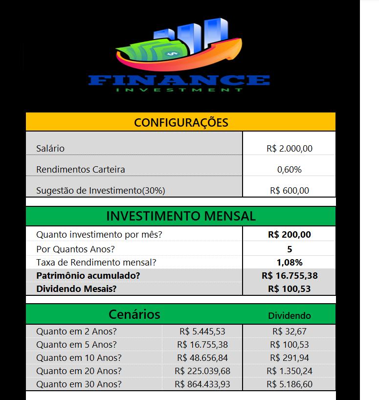
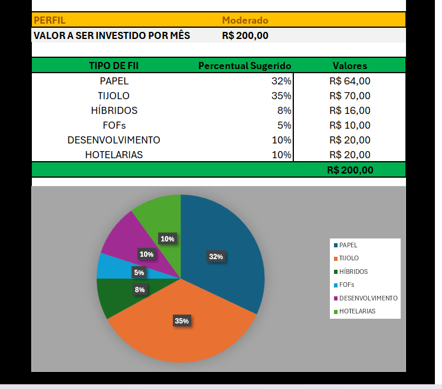

# 📊 Planilha de Fundos Imobiliários – Bootcamp DIO

Este repositório contém uma planilha desenvolvida durante o Bootcamp da [DIO](https://www.dio.me/) com foco em investimentos imobiliários (FIIs).

## 🧾 Sobre o Projeto

A planilha foi criada para:

- Organizar e visualizar dados de Fundos Imobiliários (FIIs).
- Ajudar no acompanhamento de indicadores como dividend yield, rentabilidade e P/VP.
- Servir como ferramenta de apoio para investidores.
- ## Imagens do Projeto

## 📂 Conteúdo

- Dados básicos dos FIIs
- Indicadores financeiros
- Gráficos e análises visuais
- Resumos e destaques automáticos

## 🛠️ Ferramentas Utilizadas

- Microsoft Excel
- Conhecimentos adquiridos no Bootcamp da DIO

## 📥 Como Usar

1. Baixe o arquivo `.xlsx` disponível neste repositório.
2. Abra no Excel ou outro editor compatível.
3. Navegue pelas abas para visualizar os dados e gráficos.

## 📌 Observação

Essa planilha pode ser personalizada conforme suas necessidades de investimento.

---

📫 **Contato:** Veraluciaborges80@gmail.com
🔗 **LinkedIn:** [LinkedIn](https://www.linkedin.com)

